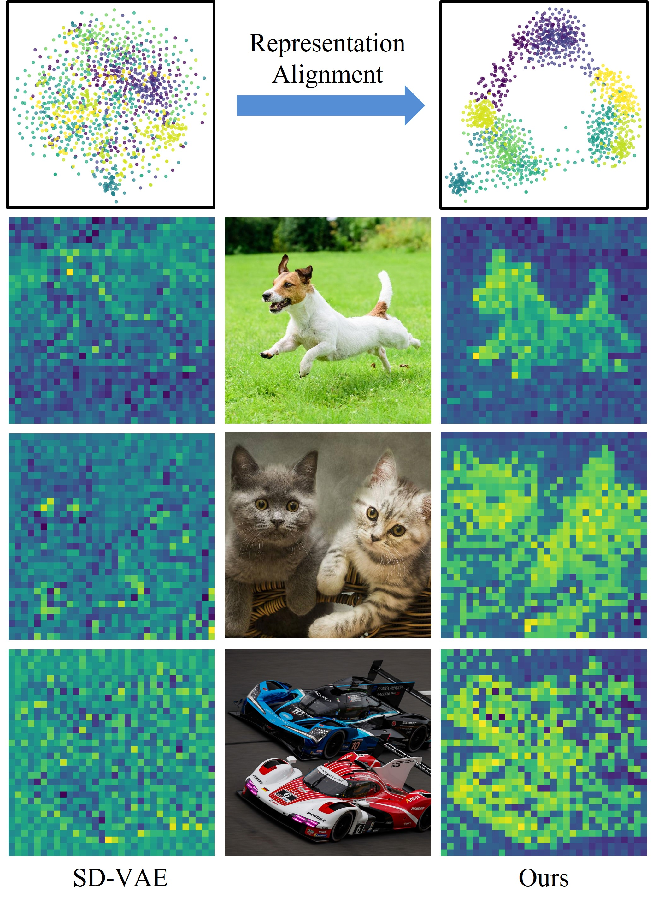
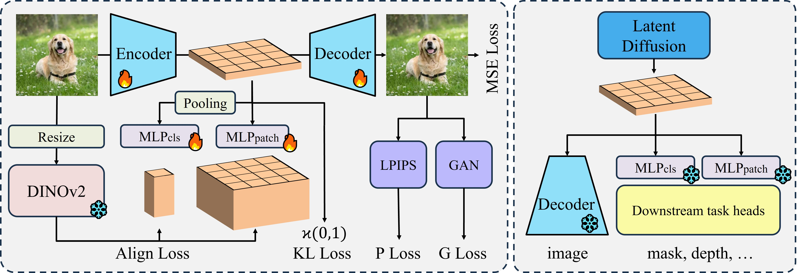

<div align="center">

# Exploring Representation-Aligned Latent Space for Better Generation

<a href="https://arxiv.org/abs/2502.00359"></a>

</div>



**Abstract:** Generative models serve as powerful tools for modeling the real world, with mainstream diffusion models, particularly those based on the latent diffusion model paradigm, achieving remarkable progress across various tasks, such as image and video synthesis. Latent diffusion models are typically trained using Variational Autoencoders (VAEs), interacting with VAE latents rather than the real samples. While this generative paradigm speeds up training and inference, the quality of the generated outputs is limited by the latents' quality. Traditional VAE latents are often seen as spatial compression in pixel space and lack explicit semantic representations, which are essential for modeling the real world. In this paper, we introduce ***ReaLS*** (Representation-Aligned Latent Space), which integrates semantic priors to improve generation performance. Extensive experiments show that fundamental DiT and SiT trained on ReaLS can achieve a 15% improvement in FID metric. Furthermore, the enhanced semantic latent space enables more perceptual downstream tasks, such as segmentation and depth estimation.



**Method Overview:** During VAE training, the latents of the VAE are aligned with the features of DINOv2 using an alignment network implemented via MLP. After the VAE training concludes, latent diffusion model training is performed in this latent space. In the inference phase, the latents generated by the diffusion model are converted into corresponding generated images through the VAE decoder. At the same time, the alignment network extracts semantic features, which are provided to the corresponding downstream task heads, enabling training-free tasks such as segmentation and depth estimation.


Visualization results on ImageNet 256×256, from the SiT-XL/2 + ReaLS, with cfg=4.0.


We compare the baseline models of DiT and SiT under the same training configuration, with Table below presenting the experimental results without using classifier-free guidance (cfg). The results indicate that under the same model parameters and training steps, diffusion models trained on ReaLS achieve significant performance improvements. Our approach requires no modifications to the diffusion model training process or additional network structures, providing a cost-free enhancement to the diffusion baseline, with an average FID improvement exceeding ***15%***.

| Model | VAE | Params | Steps | FID $\downarrow$ | sFID $\downarrow$ | IS $\uparrow$ | Pre.$\uparrow$ | Rec.$\uparrow$ |
| - | - | - | - | - | - | - | - | - |
| DiT-B-2            |  SD-VAE                   |  130M    |  400K                       |  43.5                     |       -                    |  -                       |  -                         |  -                         |
| **DiT-B/2**   |  **Ours**            |  130M    |  **400K**              |  **35.27**           |  **6.30**             |  **37.80**          |  **0.56**             |  **0.62**             | 
| SiT-B-2            |  SD-VAE                   |  130M    |  400K                       |  33.0                     |      -                     |   -                      |   -                        |  -                         |
| **SiT-B/2**   |  **Ours**            |  130M    |  **400K**              |  **27.53**           |  **5.49**             |  **49.70**          |  **0.59**             |  **0.61**             |
| **SiT-B/2**   |  **Ours**            |  130M    |  **1M**                |  **21.18**           |  **5.42**             |  **64.72**          |  **0.63**             |  **0.62**             |
| **SiT-B/2**   |  **Ours**            |  130M    |  **4M**                |  **15.83**         |  **5.25**              |  **83.34**               |  **0.65**              |  **0.63**                          | 
| SiT-L-2            |  SD-VAE                   |  458M    |  400K                       |  18.8                     |       -                    |  -                       |  -                         |   -                        |
| **SiT-L/2**   |  **Ours**            |  458M    |  **400K**              |  **16.39**           |  **4.77**             |  **76.67**          |  **0.66**                 |  **0.61**                 | 
| SiT-XL-2           |  SD-VAE                   |  675M    |  400K                       |  17.2                     |      -                     |  -                       |  -                         |  -                         |
| **SiT-XL/2**  |  **Ours**            |  675M    |  **400K**              |  **14.24**           |  **4.71**             |  **83.83**          |  **0.68**             |  **0.62**             |
| **SiT-XL/2**  |  **Ours**            |  675M    |  **2M**                |     **8.80**                      |  **4.75**                          |  **118.51**                        |  **0.70**                          |  **0.65**                         |

Table below displays the generation results of our model with cfg. In the comparative experiments with DiT-B/2 (80 epochs, cfg=1.5) and SiT-B/2 (200 epochs, cfg=1.5), the models trained on ReaLS consistently outperformed traditional VAE space, achieving better FID scores. In the SiT-XL/2 experiment, our model reached an impressive FID of ***1.82*** after a relatively low number of training epochs (i.e., 400 epochs).

| Model | Epochs | FID $\downarrow$ | sFID $\downarrow$ | IS $\uparrow$ | Pre.$\uparrow$ | Rec.$\uparrow$ |
| - | - | - | - | - | - | - |
| DiT-B/2 (cfg=1.5) | 80 | 22.21 | - | -  | - | - |
| DiT-B/2 + ReaLS (cfg=1.5) | 80 | ***19.44*** |5.45 | 70.37 | 0.68 | 0.55 |
| SiT-B/2 (cfg=1.5) | 200 | 9.3 | - | - | - | - |
| SiT-B/2 + ReaLS (cfg=1.5) | 200 | ***8.39*** | 4.64 | 131.97 | 0.77 | 0.53 | 
| SiT-XL/2 (cfg=1.5)      |  1400        |  2.06             |  4.49              |  277.50        |  0.83                 |  0.59              | 
|  SiT-XL/2 + ReaLS (cfg=1.5)   |  ***400***     |  2.83             |  4.26              |  229.59        |  0.82                 |  0.56              | 
|  SiT-XL/2 + ReaLS (cfg=1.8)*[0,0.75]   |  ***400***     |   ***1.82***             |  4.45              |  268.54        |  0.81                 |  0.60              | 


## TODO List
- [ ] Release SiT + ReaLS training code.
- [ ] Release representation alignment training code.

🌟*Initialization on 2025/02/04*: 
  * Upload the representation-aligned VAE checkpoint.

## Usage

### Prerequisite

- Clone this repository. 

    ```bash
    git clone https://github.com/black-yt/ReaLS.git
    cd ReaLS
    ```

### Pretrained model

- Download vae ckpt and configuration from  [Google Drive](https://drive.google.com/drive/folders/12DXWQS7Y5_gWLs0lBGBE7j_YNYLqk4v6?usp=sharing).

### Minimal example

```python
import torch
from diffusers.models import AutoencoderKL

vae = AutoencoderKL.from_pretrained("vae ckpt folder path")
x = torch.randn(1, 3, 256, 256)
z = vae.encode(x).latent_dist.sample() # [1, 4, 32, 32]
rec = vae.decode(z).sample # [1, 3, 256, 256]
```

## Citation

If you find our work useful in your research, we gratefully request that you consider citing our paper:

```
@misc{xu2025exploringrepresentationalignedlatentspace,
      title={Exploring Representation-Aligned Latent Space for Better Generation}, 
      author={Wanghan Xu and Xiaoyu Yue and Zidong Wang and Yao Teng and Wenlong Zhang and Xihui Liu and Luping Zhou and Wanli Ouyang and Lei Bai},
      year={2025},
      eprint={2502.00359},
      archivePrefix={arXiv},
      primaryClass={cs.LG},
      url={https://arxiv.org/abs/2502.00359}, 
}
```